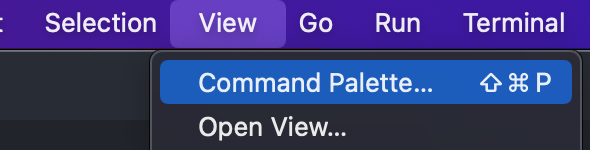
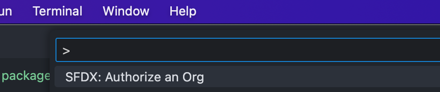
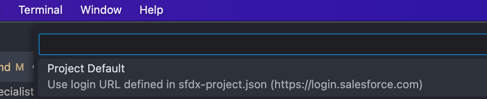
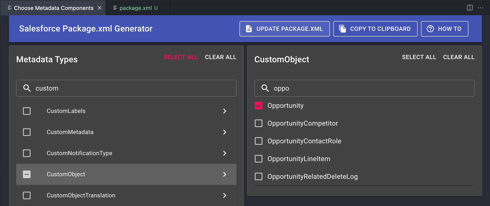

# VSCode Specialist Challenge Documentation

## Requirements

- [Salesforce CLI](https://developer.salesforce.com/tools/salesforcecli)

## VSCode Setup

We need to install the following **plugins**:

- Salesforce Extension Pack
- Salesforce Package.xml generator
- Git Graph

## GitHub Setup

1. Config your user name and email.

```
git config user.name "Jonatan Lavado"
git config user.email "jonatan.lavado@oktana.com"
```

2. Whether you want to work over **SSH** or **HTTPS**, clone the repository:

```
git clone https://github.com/jlavado-oktana/salesforce.git
```

## Enable your Salesforce Org

1. Open the Command Palette by going to `View -> Command Palette` or simply press `Shift + Command + P`.

2. Choose `SFDX: Authorize an Org`.

3. Select `Project Default` and enter your credentials.


## Create your manifest package.xml file

Create a file named `manifest/package.xml`. This file will contain all the metadata we would want to **retrieve** from the Org, and also the plugin `Salesforce Package.xml generator` works by default with that file path.

### How to retrieve
```
sf project retrieve start --manifest manifest/package.xml 
```

## Development Process

1. **Create Your Feature Branch:** Always create your feature branch from the `main` branch to ensure you're working with the latest code.
```
git checkout main
git pull
git checkout -b feature/SF-####
```
2. **Follow Branch Naming Conventions:** Use the naming convention `feature/SF-####` for your branches, where `####` corresponds to the specific task or feature identifier.
3. **Retrieve Metadata from Your Scratch Org/Dev Org:** Use the `Salesforce Package.xml generator` plugin to extract the metadata of your changes directly from your Scratch Org or Development Org.


4. **Retrieve Changes:** Execute the following command to retrieve your changes:
```
sf project retrieve start --manifest manifest/package.xml 
```
5. **Verify Your Changes:** Check to ensure that all your changes are included and that no extra or unused code has been added.

6. **Stage, Commit, and Push Your Changes:** Stage your changes, commit them with a clear and concise message, and push them to your remote repository.

7. **Create a Pull Request:** In GitHub, create a Pull Request from your feature branch into the `main` branch.

## Reference Links

- [Setting your username in Git
](https://docs.github.com/en/get-started/getting-started-with-git/setting-your-username-in-git)
- [Retrieve Components with Metadata API](https://developer.salesforce.com/docs/atlas.en-us.api_meta.meta/api_meta/meta_quickstart_retrieve_use_retrieve.htm?q=retrieve)
- [Salesforce Extensions Documentation](https://developer.salesforce.com/tools/vscode/)
- [Salesforce CLI Setup Guide](https://developer.salesforce.com/docs/atlas.en-us.sfdx_setup.meta/sfdx_setup/sfdx_setup_intro.htm)
- [Salesforce DX Developer Guide](https://developer.salesforce.com/docs/atlas.en-us.sfdx_dev.meta/sfdx_dev/sfdx_dev_intro.htm)
- [Salesforce CLI Command Reference](https://developer.salesforce.com/docs/atlas.en-us.sfdx_cli_reference.meta/sfdx_cli_reference/cli_reference.htm)
